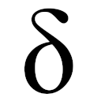

# TheDavidDelta personal webpage

Very tiny personal page made with [Nextra](https://nextra.vercel.app/) for being able to write some blog posts until I build one by myself.

## License

Copyright © 2021 [TheDavidDelta](https://github.com/TheDavidDelta).  
This project is [GNU AGPLv3](./LICENSE) licensed.
