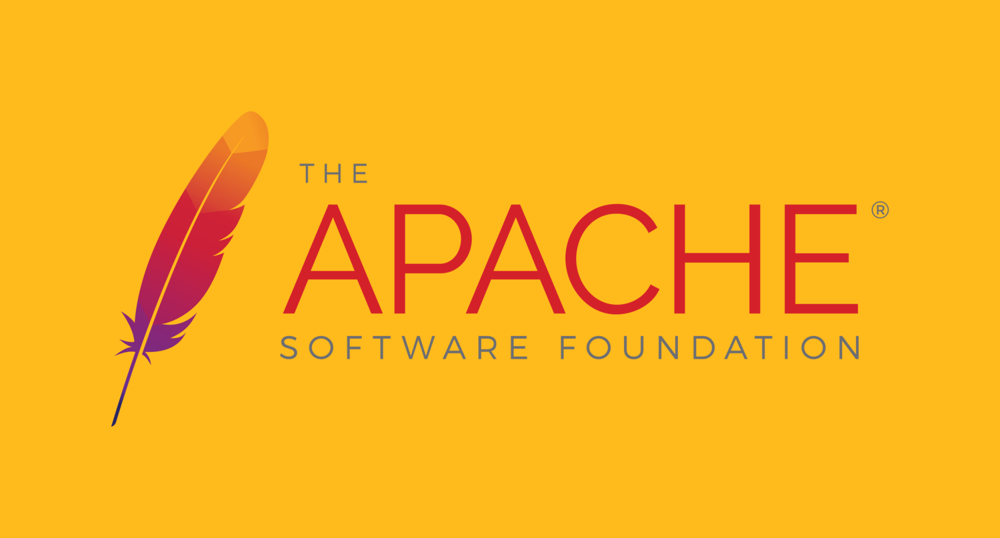

import CustomHead from "../../../components/CustomHead";

<CustomHead
    customTitle="El software en la sociedad mercantilista"
    customDescription="[es] Reflexión sobre el papel del Open Source y el Software Libre en la actualidad"
/>

# El software en la sociedad mercantilista

Dentro del desarrollo informático existe un "movimiento" cada vez más imperante para hacer software de código abierto, u *Open Source*. Esto implica que el código fuente del software sea públicamente consultable y utilizable por todos.

Sobre el papel tiene muchas ventajas sobre el software privativo (del cual no se dispone del código), ya que permite auditar de forma pública el funcionamiento del software o utilizar el código para tus necesidades, como es por ejemplo mi caso ahora mismo, que acabo de montar un simple blog en apenas unas horas utilizando [*Nextra*](https://github.com/shuding/nextra) (software licenciado bajo [MIT](https://mit-license.org/), una licencia *Open Source* permisiva) para poder escribir este artículo.

Pero la realidad actual del "movimiento" *Open Source* es mucho más oscura.

## El lado oscuro del *Open Source*

Esta semana ha explotado una [vulnerabilidad de día 0](https://es.wikipedia.org/wiki/Ataque_de_d%C3%ADa_cero) en `log4j2`, un famoso paquete de *Apache* para registro de datos en Java, el cual es utilizado por millones de proyectos en todo el mundo. Este paquete, el cual es parte de la infraestructura base de miles de empresas y cuya vulnerabilidad ha hecho perder millones, está actualmente mantenido por una persona que tiene 3 *sponsors* (mecenas) en GitHub.

Este mantenedor trabaja en una librería tan importante en su tiempo libre, mientras lo complementa con un trabajo a tiempo completo. Tiene *de facto* dos trabajos, uno de ellos con remuneración cercana a 0, el cual genera millones de dólares a miles de empresas. Estos días, además, no ha hecho más que recibir burlas y presión de la "comunidad" por la vulnerabilidad, mientras se ha pasado, seguramente, algún día sin dormir de forma desinteresada y, por supuesto, no remunerada, para evitar que las empresas a la que sustenta pierdan más dinero.

Si nos vamos al ecosistema JavaScript, hay un paquete archiconocido llamado `core-js` el cual hace *polyfill* del [estándar *EcmaScript*](https://github.com/tc39) antes de que esté soportado por los motores oficiales. Es uno de los paquetes más usados del repositorio de *NPM*, utilizado por muchísimos proyectos de compañías enormes (como el propio *Angular* de *Google* o *React* de *Facebook*) y nunca ha conseguido soporte económico de ninguna de estas empresas.

Además, hace unos años, su autor dejó su trabajo para dedicarse a ello a tiempo completo y no consiguió mucha ayuda, lo que se le juntó con unos problemas personales por los que necesitaba mucho dinero y decidió meter un simple mensaje de 5 líneas tras la instalación del paquete pidiendo donaciones e informando que estaba buscando trabajo.

La respuesta de parte de la comunidad a esto no resultó en un vuelco completo en su ayuda, sino en diversos *issues* en el repositorio del paquete [quejándose de que les molestaba el mensaje](https://github.com/zloirock/core-js/issues/548). Al final, el mantenedor no pudo costear los problemas personales y acabó entrando un tiempo en la cárcel.

Quedándonos todavía dentro del ecosistema JavaScript, hablemos ahora de la que es la librería (o *framework*, está en [discusión](https://twitter.com/rickhanlonii/status/1397543552494841856)) más importante de la web en la actualidad: `React`.

React es una librería de desarrollo *front-end* (la parte cliente de las páginas web) creada y mantenida por *Facebook* (o *Meta*) que sirve para, de forma completa o complementada con otra de *back-end*, crear páginas web interactivas. Algunos servicios conocidos hechos con React son *Discord*, *Paypal*, *Facebook*, *Instagram*, *Netflix*, *Mastodon*... incluso la propia página que estás viendo ahora mismo (¿recuerdas Nextra? Usa React por debajo) y mi propia fuente de ingresos (actualmente trabajo en un proyecto React).

¿Qué tiene de malo React pues, si permite a individuos como yo o *start-ups* como la que me tiene empleado realizar con mucha facilidad este tipo de páginas? Evidentemente *Facebook* no la hizo *Open Source* por amor al arte, así que, ¿dónde está el truco? En la comunidad.

React es una librería muy poco *opinionated*. Eso quiere decir que se ocupa de la arquitectura del código, pero no de ningún detalle de implementación, como puede ser el estilizado, la gestión del estado global, las pruebas de código, el renderizado en el servidor o la estructura del proyecto, entre otros. Todos estos asuntos se gestionan mediante librerías, *frameworks* o meta-*frameworks* hechos por la comunidad, o como mucho, por alguna otra empresa (evidentemente mucho más pequeña que *Facebook*). Sin hablar de, evidentemente, la gente que contribuya a los paquetes principales de *React* como contribuyentes *Open Source*.

De esta manera, y aunque *Facebook* ofrezca a los desarrolladores algo tan maravilloso como es React, esto no deja de ser con la única intención de **beneficiarse de trabajo ajeno de forma gratuita para multiplicar sus ganancias**, el cual es hoy en día el principal cometido del "movimiento" *Open Source*.

Desde hace unos años, muchas empresas se han subido al carro del "movimiento" *Open Source* para aprovecharse de esto, destacando entre ellas *Microsoft* o el propio *Facebook*, pero si hay una que les alumbró el camino a todas esa es *Google*.

## El maestro de esta técnica: *Google*

En el año 2003 un grupo de desarrolladores fundaron una compañía para crear un sistema operativo para cámaras digitales. Ese mercado acabaría por no cuajar, lo cual derivó el proyecto hacia la cración de un sistema operativo de código abierto para teléfonos móviles basado en el [*kernel* de Linux](https://github.com/torvalds/linux/). El proyecto se bautizó como `Android`.

Posteriormente, en el año 2005, *Google* adquirió *Android, Inc.* y con el paso de unos años, en el 2008, sale la primera versión del sistema. Aunque al principio tuvo dura competencia de *iOS*, posteriormente no ha dejado de crecer hasta ser el sistema operativo más usado del mundo, con un uso [casi 5 veces superior a *Windows*](https://en.wikipedia.org/wiki/Usage_share_of_operating_systems).

El éxito de *Android* se podría resumir en una palabra: **gratis**. Al ser un proyecto *Open Source*, cualquier fabricante de móviles puede utilizarlo en sus dispositivos, añadiéndole además una capa de personalización única de la empresa manufacturera sin tener que publicar el código de sus modificaciones. Sin hablar del acceso al mayor catálogo de aplicaciones del mundo para tus dispositivos.

¿Y qué gana *Google* con eso? También es una palabra: **monopolio**. *Google* actualmente tiene bajo su control a más cantidad de usuarios que ningún otro software en el mundo. Los monopolios tecnológicos ejercen un poder cíclico, en el cual tu cantidad de usuarios influye en los desarrolladores y las empresas, que quieren publicar sus aplicaciones para un número lo más alto posible de usuarios, y también en los fabricantes, que quieren vender su producto con el sistema al que ya todos están acostumbrados y que además tiene el mayor catálogo de apps. Todo esto influye cíclicamente en los usuarios que eligen estos sistemas porque vienen por defecto en más sitios y tienen más aplicaciones.

*Google* ha conseguido con *Android* lo mismo que *Microsoft* en los 90 con *Windows*, solo que sin jugadas sucias, sin pisotear a algunas comunidades, y sin robar código, sino simplemente mediante el truco del *Open Source*.

*Google* no tardó en verle rentabilidad a la jugada y, antes de que ninguna otra empresa se subiese al carro, repitió la jugada con otro proyecto que seguro todos conocéis: el navegador `Chromium`.

De nuevo, volvió a crear una base *Open Source*, el propio *Chromium*, y un recubrimiento privativo que es el famoso *Chrome*. No tardó en empezar a popularizarse y postularse como uno de los 3 más usados, gracias principalmente a, aquí sí, algunas técnicas sucias dentro de su ya establecida plataforma (el buscador, el correo, *YouTube* o el propio *Android*) para empujar a que sus usuarios se pasasen también a su navegador.

Una vez en esa situación, cuando una compañía nueva se postulaba a crear un navegador propio, empezaron a tirar de *Chromium*. De nuevo, tiene una base *Open Source* que pueden modificar y privatizar. Ese fue el caso de *Opera*, *Brave* (aunque este sigue siendo *Open Source*) o el propio *Microsoft Edge*. Una vez en este punto, vuelve el efecto cíclico del monopolio, esta vez afectado por las implementaciones de HTML, CSS y JavaScript dentro de su motor, y con las extensiones que se desarrollan para este.

## El *Software Libre*

El "movimiento" *Open Source* surgió al final de los 90 de otro movimiento bastante más antiguo llamado *Software Libre*, creado al inicio de los 80 alrededor del [*Proyecto GNU*](https://www.gnu.org/) y la [*Free Software Foundation*](https://www.fsf.org/).

Este aboga por la libertad real del software, y no solo de su código, porque esta no pasa por la libertad de una empresa de usar ese código para su propio beneficio sino la del usuario de poder acceder a ese código y todas sus modificaciones, o sea, que nadie pueda privatizarlo. El movimiento del *Software Libre* enumera así 4 libertades a cumplir para que un software sea libre:

0. Ejecutar el programa como se desee, con cualquier propósito
1. Estudiar cómo funciona el programa, y cambiarlo para que haga lo que se desee
2. Redistribuir copias para ayudar a otros
3. Distribuir copias de sus versiones modificadas a terceros

Por regla generar, recomendaría evitar licenciar **cualquier** tipo de software de código abierto con licencias *Open Source* permisivas (como la [MIT](https://mit-license.org/) o la [Apache](https://apache.org/licenses/LICENSE-2.0)) y utilizar en su lugar licencias de software libre, también conocidas como *Copyleft* (como las [GPLv3](https://www.gnu.org/licenses/licenses.html)). De esta manera tu código no podría ser modificado de forma privativa ni incorporado en un proyecto privativo.

Esto evita muchos de los problemas que tiene el software *Open Source*, el cual es un aprovechamiento de las ideas originales del *Software Libre* con fines mercantilistas. Pero el *Software Libre* está lejos de ser perfecto.

Pongamos como ejemplo [*Mastodon*](https://joinmastodon.org/), una red social descentralizada y federada creada como alternativa a *Twitter*. El funcionamiento es muy similar, pero en *Mastodon* cualquiera puede montar una instancia propia que se comunique con el resto (incluso con otros servicios que usen el mismo protocolo, a lo que se llama *Fediverso*). Además, está licenciado mediante la AGPLv3 por lo que nadie puede aprovecharse del código desarrollado para montar una plataforma privativa y mercantilista, [como ocurrió hace poco con Truth Social, el intento de red social de Trump](https://blog.joinmastodon.org/2021/10/trumps-new-social-media-platform-found-using-mastodon-code/).

Pero la única razón de la "censura" a la plataforma de Trump ha sido por motivo de licencia. ¿Y si relanzasen la plataforma manteniendo la libertad del software modificado? Pues no tenemos que suponer nada, eso ya ocurrió hace años con [*Gab*](https://es.wikipedia.org/wiki/Gab_(red_social)).

*Gab* es un *fork* (bifurcación) de *Mastodon*, o sea, una modificación que ha seguido otra evolución de desarrollo, pero que surge del código ya existente del proyecto, así como también puede utilizar el nuevo siempre y cuando cumpla la licencia. *Gab* es también *Software Libre* licenciado bajo AGPLv3, cumpliendo así el "acuerdo legal" con la licencia de *Mastodon*. Entonces, ¿qué hay de malo en *Gab*? Que es hogar de racistas, xenófobos y fascistas.

O sea, el código de *Mastodon* sirve como fuente a que otro grupo de gente mantenga su incensurable casa del horror. No porque *Mastodon* esté de acuerdo, sino porque no puede hacer nada. Este es el punto donde hay gente que ve un problema y gente que no. Para algunos, no se debe restringir más allá la usabilidad del software porque estaríamos entrando en cuestiones de censura ideológica, pero para mi es un gran problema que se debería intentar resolver.

No ya en el caso concreto de *Mastodon*, sino en general dentro del *Software Libre*, el cual se caracteriza, en su confrontación con el *Open Source*, en analizar y detectar el verdadero problema en lugar de depender estrictamente del axioma genérico de la *"libertad" de uso del código*. De igual manera, también deberíamos analizar esta situación desde un punto de vista más materialista, en lugar de hacerlo desde la *"libertad" de uso del software*, porque un software hecho sin análisis de sus posibles aplicaciones negativas es como una mejora científica sin un análisis ético.

## La sociedad mercantilista

Como comentaba anteriormente y volviendo a un análisis más económico de la situación, el software *Open Source* provoca que los desarrolladores *hobbistas* sirvan de mano de obra gratuita a grandes empresas, y el *Software Libre* soluciona este punto porque evita que el código pueda ser utilizado de forma privativa. Espera, ¿realmente lo soluciona?

El *Software Libre* evita que esa fuerza de trabajo se vaya a manos de los beneficios de las compañías, pero no evita esa fuerza de trabajo ni la da una mejor cabida. Existen casos, como son la mayoría de proyectos grandes, en los que las donaciones sustentan la manutención de parte de los mantenedores a tiempo completo, pero incluso en esos, hay no pocas personas dedicando la mayoría de su tiempo libre por puro desinterés, como ocurría con el desarrollador de `log4j2` dentro de la *Fundación Apache*.

A fin de cuentas, en nuestro modelo social actual todo está definido en base a su capacidad de beneficio. Es lo que evalúa si una actividad es o no "productiva", si el tiempo está "bien aprovechado" o si se está "procrastinando" respecto a las tareas "de verdad", e incluso, dependiendo de la moralidad de algunos, si una relación social es o no "provechosa".

Y en absoluto quiero dar a entender que no se debe desarrollar *Software Libre*, sobretodo cuando [yo mismo soy uno de los que lo hace](https://github.com/TheDavidDelta). Al fin y al cabo, en una situación como esta es de verdadera importancia tener un hueco dentro de nosotros donde no quepa el interés, y se puedan desarrollar actividades que no sean "productivas", así como poder ayudar a otros sin ninguna razón aparente. Y en concreto, en el campo del software, se necesita alguna alternativa real y de calidad a los grandes servicios privativos, a veces incluso mejor que ellos como en el caso de [*VLC*](https://www.videolan.org/vlc/), [*Blender*](https://www.blender.org/), [*Krita*](https://krita.org/es/), [*OBS Studio*](https://obsproject.com/es/), [*Bitwarden*](https://bitwarden.com/) y otros muchos.

Pero hay que tener en mente que no es ninguna solución a largo plazo, sino solo pequeños parches. El único auge real que ha habido de algo similar ha sido justamente el "movimiento" *Open Source* y solo debido a su extensa mercantilización. Estamos en una sociedad mercantilista y el *Software Libre* simplemente no encaja en ella.
